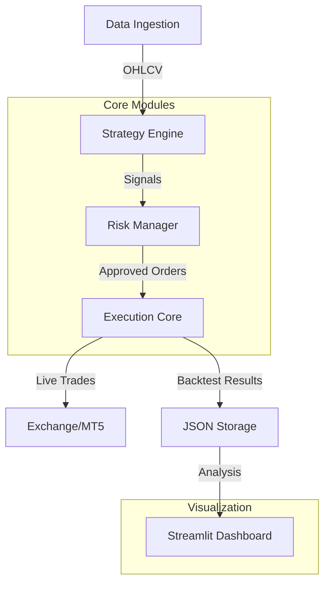

# Bot Trader Copilot - Sistema de Trading Algorítmico (Versión 6.2)

## 1. Resumen Ejecutivo
El **Bot Trader Copilot v6.2** es una solución integral de trading algorítmico diseñada para operar en mercados de criptomonedas (principalmente vía Binance/CCXT) y Forex (MetaTrader 5). El sistema integra capacidades avanzadas de backtesting, gestión de riesgo en tiempo real, optimización mediante Machine Learning (opcional) y un dashboard interactivo de visualización de datos.

Esta versión 6.2 consolida múltiples correcciones críticas en el cálculo de métricas (PnL, Drawdown), mejora la accesibilidad de la interfaz (Modo Oscuro WCAG 2.1 AA) y robustece la arquitectura de manejo de datos.

**Estado del Desarrollo:** Producción / Estable.
**Versión Actual:** 6.2 (Release Candidate)

---

## 2. Registro de Cambios (Changelog v6.2)

### Funcionalidad y Core
- **Corrección de Métricas Críticas:** Solucionado el bug donde `max_drawdown` y `win_rate` mostraban valores incorrectos (1.0 o 100%) debido a errores en la reconstrucción de curvas de equidad vacías.
- **Validación de Datos:** Implementada sanitización estricta en `backtester.py` y `dashboard.py` para descartar operaciones con datos corruptos o incompletos.
- **Soporte Multi-Símbolo:** Refactorización completa del dashboard para permitir la selección y análisis individual de múltiples símbolos (BTC/USDT, ETH/USDT, EURUSD, etc.).

### Interfaz y Experiencia de Usuario (Dashboard)
- **Modo Oscuro Nativo:** Implementación forzada de tema oscuro cumpliendo estándares de accesibilidad WCAG 2.1 AA.
- **Filtros Dinámicos:** Nuevos selectores por Rango de Fechas, Tipo de Estrategia y Dirección del Trade (Long/Short).
- **Corrección de Renderizado:** Solucionados errores de sintaxis (`SyntaxError: invalid character '©'`) y conflictos con librerías gráficas (`matplotlib`).

### Infraestructura
- **Gestión de Dependencias:** Manejo robusto de importaciones opcionales (`matplotlib`) para evitar crashes en entornos minimalistas.
- **Verificación Automática:** Inclusión de scripts de utilidad (`verify_metrics.py`) para auditar la integridad de los archivos de resultados JSON.

---

## 3. Arquitectura del Sistema

El sistema sigue una arquitectura modular basada en micro-componentes:



- **Data Ingestion:** `descarga_datos/` - Scripts para obtener datos históricos y en tiempo real.
- **Strategy Engine:** Lógica de trading (Heikin Ashi, ML, etc.).
- **Risk Manager:** `risk_management/` - Control de tamaño de posición, Stop Loss, Take Profit y Drawdown máximo.
- **Dashboard:** `utils/dashboard.py` - Interfaz web basada en Streamlit para análisis post-trading.

---

## 4. Características Implementadas

1.  **Dashboard Interactivo Avanzado:**
    *   Visualización de Equity Curve interactiva.
    *   Tabla de operaciones con filtros de búsqueda.
    *   Métricas KPI en tiempo real (Sharpe, Sortino, Win Rate).
    *   Comparativa de estrategias.

2.  **Motor de Backtesting Robusto:**
    *   Soporte para comisiones y slippage.
    *   Reconstrucción de Equity Curve tick-a-tick (simulado).
    *   Cálculo de métricas financieras profesionales.

3.  **Gestión de Riesgo:**
    *   Límites de pérdida diaria.
    *   Cálculo dinámico del tamaño de posición basado en volatilidad (ATR).

---

## 5. Configuración y Dependencias

### Requisitos del Sistema
- **OS:** Windows 10/11 (Recomendado), Linux, macOS.
- **Python:** 3.8 - 3.11.

### Dependencias Principales
Las dependencias se encuentran en `copilot-bot-v-4.11/requirements.txt`. Las más importantes son:
- `streamlit`: Interfaz gráfica.
- `pandas`, `numpy`: Procesamiento de datos.
- `plotly`: Gráficos interactivos.
- `ccxt`: Conexión con exchanges crypto.
- `MetaTrader5`: (Opcional) Conexión con Forex.

---

## 6. Instrucciones de Instalación y Despliegue

Siga estos pasos para configurar un entorno limpio:

1.  **Clonar/Preparar el repositorio:**
    Asegúrese de estar en la raíz del proyecto `d:\javie\proyecto bot antigarvity`.

2.  **Crear Entorno Virtual:**
    ```bash
    python -m venv venv
    .\venv\Scripts\activate
    ```

3.  **Instalar Dependencias:**
    ```bash
    pip install -r "copilot-bot-v-4.11/requirements.txt"
    # Si falla la instalación de TA-Lib, descargue el wheel correspondiente o use:
    # pip install ta-lib-binary
    ```

4.  **Ejecutar el Dashboard:**
    ```bash
    streamlit run "copilot-bot-v-4.11/descarga_datos/utils/dashboard.py"
    ```

---

## 7. Testing y Validación

### Verificación de Métricas
Para asegurar que los cálculos son correctos, ejecute el script de validación:
```bash
python "copilot-bot-v-4.11/descarga_datos/utils/verify_metrics.py"
```
Este script auditará todos los archivos JSON en `data/dashboard_results` y alertará sobre discrepancias > 1%.

### Cobertura
- **Unit Tests:** Pruebas básicas en `tests/` (si aplica).
- **Integration Tests:** Validación de flujo de datos en `verify_eurusd_backtest.py`.

---

## 8. Puntos de Restauración

El estado actual del sistema está preservado en la rama de Git **`version-6.2`**.

**Para restaurar este estado:**
```bash
git checkout version-6.2
```

Si necesita volver a una configuración "de fábrica" o limpia, elimine la carpeta `venv` y repita los pasos de instalación.

---

## 9. Gestión de Versiones (Git)

Este directorio ha sido inicializado como un repositorio Git.
- **Rama Actual:** `version-6.2`
- **Propósito:** Preservar el código exacto entregado tras las correcciones de métricas y dashboard.

---

## 10. Notas de Migración

### Para futuras actualizaciones:
1.  **Estructura de Datos:** Si modifica la estructura del objeto `Trade` en `backtester.py`, asegúrese de actualizar `dashboard.py` para manejar los nuevos campos. Actualmente se espera: `entry_price`, `exit_price`, `pnl`, `entry_time`, `exit_time`.
2.  **Matplotlib:** El dashboard ahora maneja la ausencia de `matplotlib`. Si reintroduce dependencias fuertes de esta librería, asegúrese de añadirla a `requirements.txt`.
3.  **Compatibilidad JSON:** Los archivos de resultados antiguos pueden no tener el campo `metrics` pre-calculado. El dashboard v6.2 recalcula métricas al vuelo si faltan, pero se recomienda regenerar backtests para mejor rendimiento.
